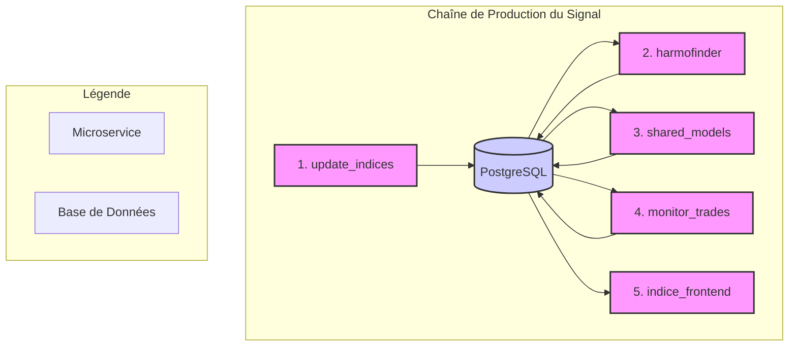

# Architecture : Une Chaîne de Valeur Logique

Notre système est conçu non pas comme un réseau complexe de services interconnectés, mais comme une **chaîne de valeur séquentielle et robuste**. Elle est composée de cinq microservices indépendants qui communiquent de manière asynchrone via une base de données centrale (PostgreSQL). Cette architecture "database-centric" garantit une grande résilience, une traçabilité complète des données et une simplification des déploiements.

Chaque microservice a un rôle unique et bien défini, agissant comme un maillon spécialisé dans la chaîne de production du signal de trading. Il n'y a **aucune communication directe** entre les services ; la base de données est la seule source de vérité.

## Diagramme de la Chaîne de Production du Signal

## Rôle des Microservices

1.  **`update_indices` (Collecte & Enrichissement)**
    - **Mission :** Est le point d'entrée des données de marché brutes (prix, volume).
    - **Rôle :** Il collecte, nettoie et enrichit les données en y ajoutant des indicateurs techniques de base. Il prépare le terrain pour l'analyse en stockant ces informations de manière structurée dans la base de données.

2.  **`harmofinder` (Détection de Structures)**
    - **Mission :** Surveille en continu les données enrichies pour y déceler des structures harmoniques potentielles.
    - **Rôle :** C'est le moteur de détection brute. Lorsqu'un pattern potentiel est identifié, il l'enregistre dans la base de données avec un statut "candidat", sans aucun jugement sur sa qualité.

3.  **`shared_models` (Calcul de Probabilité)**
    - **Mission :** Appliquer l'intelligence du système pour évaluer la pertinence des patterns candidats.
    - **Rôle :** Ce service central récupère les patterns candidats et leur applique le **Score de Confiance (ML)**. C'est ici que la probabilité de succès est calculée. Le résultat (un score et un statut "validé" ou "rejeté") est ensuite réinscrit dans la base de données.

4.  **`monitor_trades` (Application du Risque & Exécution)**
    - **Mission :** Gérer le cycle de vie des trades actifs.
    - **Rôle :** Ce service surveille les patterns "validés". Il est responsable de l'application des règles de risque (Stop-Loss, Take-Profit) et de l'exécution des ordres (simulée ou réelle). Il met à jour en temps réel le statut des positions dans la base de données.

5.  **`indice_frontend` (Visualisation)**
    - **Mission :** Offrir à l'utilisateur une vue claire et en temps réel de l'état du système.
    - **Rôle :** Ce service lit en permanence la base de données pour afficher les signaux, les trades actifs et les performances. Il est la représentation visuelle de la chaîne de valeur et ne contient aucune logique de trading.

Cette architecture garantit que chaque étape est découplée, ce qui nous permet de mettre à jour ou d'optimiser un maillon (par exemple, le modèle de `shared_models`) sans jamais interrompre le reste de la chaîne.
