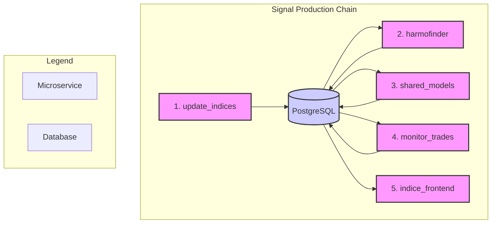

# Architecture: A Logical Value Chain

Our system is designed not as a complex network of interconnected services, but as a **sequential and robust value chain**. It consists of five independent microservices that communicate asynchronously via a central database (PostgreSQL). This "database-centric" architecture ensures high resilience, complete data traceability, and simplified deployments.

Each microservice has a unique and well-defined role, acting as a specialized link in the trading signal production chain. There is **no direct communication** between services; the database is the single source of truth.

## Signal Production Chain Diagram

## Role of Microservices

1.  **`update_indices` (Collection & Enrichment)**
    - **Mission:** Serves as the entry point for raw market data (price, volume).
    - **Role:** It collects, cleans, and enriches the data by adding basic technical indicators. It prepares the ground for analysis by storing this information in a structured manner in the database.

2.  **`harmofinder` (Structure Detection)**
    - **Mission:** Continuously monitors the enriched data to detect potential harmonic structures.
    - **Role:** This is the raw detection engine. When a potential pattern is identified, it saves it to the database with a "candidate" status, without any judgment on its quality.

3.  **`shared_models` (Probability Calculation)**
    - **Mission:** To apply the system's intelligence to assess the relevance of candidate patterns.
    - **Role:** This central service retrieves candidate patterns and applies the **Confidence Score (ML)** to them. This is where the probability of success is calculated. The result (a score and a "validated" or "rejected" status) is then written back to the database.

4.  **`monitor_trades` (Risk Application & Execution)**
    - **Mission:** To manage the lifecycle of active trades.
    - **Role:** This service monitors the "validated" patterns. It is responsible for applying risk rules (Stop-Loss, Take-Profit) and executing orders (simulated or real). It updates the status of positions in the database in real-time.

5.  **`indice_frontend` (Visualization)**
    - **Mission:** To provide the user with a clear, real-time view of the system's state.
    - **Role:** This service continuously reads the database to display signals, active trades, and performance. It is the visual representation of the value chain and contains no trading logic.

This architecture ensures that each step is decoupled, allowing us to update or optimize one link (e.g., the `shared_models` model) without ever interrupting the rest of the chain.
